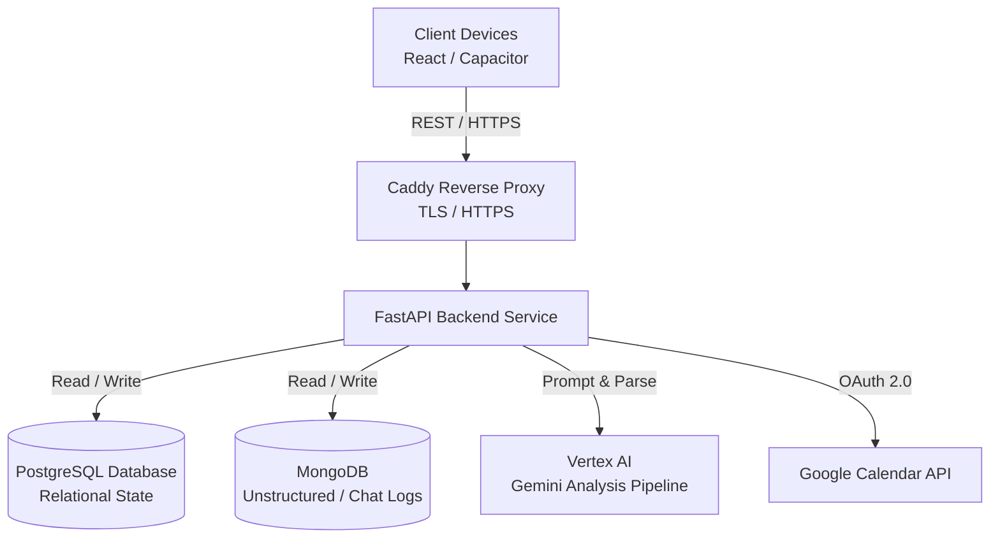

# Loadout (LifePlan)

Loadout is a comprehensive, AI-driven personal routine, fitness, and nutrition assistant. It allows users to orchestrate their weekly schedule, automatically track meals and macronutrients via AI estimation, analyze workouts, and maintain personal budgets.

## System Architecture



## Key Features

- **Automated Scheduling**: View all events in an infinite scrolling calendar. Connects securely with the Google Calendar API for automatic synchronization.
- **AI Nutrition Parsing**: A zero-friction logging mechanism. Users input natural language descriptions of their meals ("150g chicken and some rice"), and the Gemini backend instantly estimates structured macronutrients (Calories, Protein, Carbs, Fat).
- **Intelligent Workout Logging**: Track cardio and lifting routines. Features AI fallback checks to ensure correct fitness data validation.
- **Cross-Platform Delivery**: Deployable as a web PWA and fully bundled as a native Android application using Capacitor.
- **Secure Authentication**: Includes custom JWT session management, role-based admin controls, and native Google OAuth pipelines.

## Technology Stack

### Backend
- **Framework**: FastAPI (Python 3.10+)
- **Databases**: PostgreSQL (Async SQLAlchemy) & MongoDB (Motor)
- **AI Integration**: Google Cloud Vertex AI (gemini-1.5-flash / gemini-2.0-flash-001)
- **Infrastructure**: Docker Compose, Caddy Server

### Frontend / Mobile
- **Core**: React 18, Vite
- **Styling**: TailwindCSS
- **Native Wrapper**: Ionic Capacitor (v8)
- **PWA Integration**: vite-plugin-pwa

## Deployment Guide

The application utilizes Docker Compose for highly reproducible infrastructure management. 

### Environment Configuration
The backend container requires several critical environment variables. Example `.env.prod`:
```ini
APP_NAME=Loadout
DEBUG=false
DATABASE_URL=postgresql+asyncpg://user:password@/db...
SECRET_KEY=long_secure_string_here
ALLOWED_ORIGINS=https://loadedout.online,http://localhost,capacitor://localhost
GCP_PROJECT_ID=your-project-id
VERTEX_AI_MODEL=gemini-1.5-flash
```

### Starting Production Services
1. Ensure the databases (`mongo`, `db`) are actively running within the `docker-compose.prod.yml`.
2. Construct and detach the containers using the production environment file:
```bash
docker compose -f docker-compose.prod.yml --env-file .env.prod up -d --build backend
```

## Repository Structure

- `/backend`: Core Python FastAPI application, REST endpoints, and SQLAlchemy ORMs.
- `/frontend`: The React UI along with the Capacitor bundle output (`/android`).
- `/infra`: Docker compose files and production proxy configurations.
